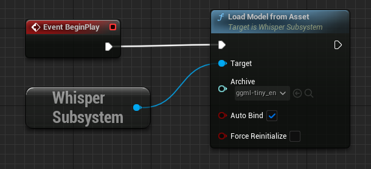

# YnnkWhisperRecognizer

## Description

YnnkWhisperRecognizer is an add-on for [Ynnk Voice Lipsync](https://www.unrealengine.com/marketplace/en-US/product/ynnk-voice-lipsync) UE5 plugin. It allows to use [whisper.cpp](https://github.com/ggerganov/whisper.cpp/) for voice recognition instead of default [Vosk toolkit](https://alphacephei.com/vosk/).

Pros: whisper is platform-independent and can be packaged for iOS, Mac, Linux (Vosk works on Windows and Android).
Cons: whisper.cpp implementation doesn't work well for streamed audio input. Moreover, it's slower then Vosk.

## Usage

1. Download packaged plugin (from Releases) and extract it to C:/Program Files/Epic Games/UE_(version)/Engine/Plugins/Marketplace

2. Enable the plugin in your project (Edit -> Plugins) and restart Unreal editor.

3. Download language model here: https://huggingface.co/ggerganov/whisper.cpp/tree/main
You need either ggml-tiny.en.bin (English-only) or ggml-tiny.bin (multilangual). Large models work better, but for lip-sync generation rapidity and performance are more important then quallity of recognition.

4. Import .bin file to your project (drag&drop to Content Browser) as a binary archive.

5. In BeginPlay event of appropriate blueprint call (Whisper Subsystem) --> Load Model from Asset.

6. And done. YnnkVoiceLipsync will use whisper now.
